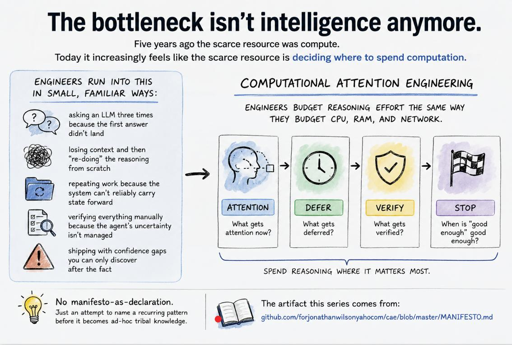

# cae

a procedural  knowledge framework for agentic work

Jonathan Wilson et machina*

# READ THE [MANIFESTO](MANIFESTO.md)

laugh out loud - see what your stack thinks about it

# IF YOU WANT TO CONTRIBUTE TO THIS REPO FOR ANY REASON

easiest way is come up with content for some undeveloped conceptual node here, then feed that to an llm with a link to this repo and this scaffolding file for format hints: 

[https://github.com/forjonathanwilsonyahoocom/cae/blob/master/tools/ROBOTS.md](https://github.com/forjonathanwilsonyahoocom/cae/blob/master/tools/ROBOTS.md)

fork this repo then open a pr for me to review, 

i've pointed most of the LLMs here and they all immediately come up with ideas. 

this is a really interesting experiment that i have the privilege of being a part of

Computational Attention Engineering does not propose a new AI model, architecture, or implementation framework. It proposes a discipline for engineering autonomous work: how systems decide what deserves computation, what evidence is sufficient, when to search, when to stop, and how experience improves future decisions.

Context Capsule: Computational Attention Engineering v0.1

Core thesis

As AI systems become more capable, the scarce resource shifts from intelligence to disciplined computational attention.
Autonomous systems need the same kind of attention engineering humans have developed for every other high-consequence domain.

The engineering problem is no longer "How do I give the model more context?"

It becomes:

"How do I allocate finite reasoning effort where it creates the most value?"

Working definition

Computational Attention Engineering is the discipline of designing how autonomous systems allocate finite computational attention under uncertainty.

Primary design principles

Separate Mission (why the work exists) from Policy (how attention should be spent).
Use priors to reduce unnecessary search.
Use anti-hypotheses to avoid expensive rabbit holes.
Treat token budget as a resource allocation policy, not just a cost estimate.
Organize investigations into staged discovery rather than flat question lists.
Allocate verification effort based on the consequence of being wrong.
Periodically compress working memory into durable facts, surviving hypotheses, and open questions.
Instrument autonomous work with telemetry so investigation strategies can be measured and improved.

Control loop

Mission → Policy → Execution → Telemetry → Policy Adaptation

Design philosophy

Don't maximize computation.

Maximize uncertainty reduced per unit of computation.

The goal is not smarter agents.

The goal is making their attention measurable, spendable, and continuously improvable.

# footnote
* "et machina" denotes substantive computational collaboration by one or more AI systems under the direction and responsibility of the named human authors.

